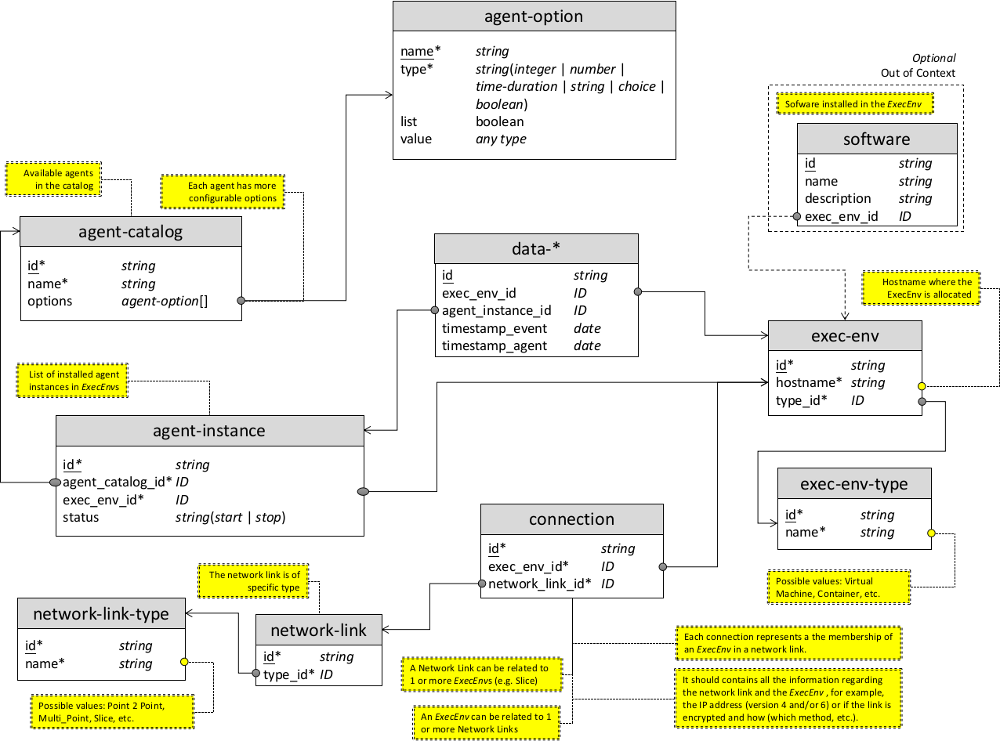

# Context Broker Manager

APIs to interact with the ``Context Broker``'s database. Through a **REST** Interface, it exposes data and events stored in the internal storage system in a structured way. It provides uniform access to the capabilities of monitoring agents.

---

## Table of Contents

- [Context Broker Manager](#context-broker-manager)
  - [Table of Contents](#table-of-contents)
- [Terminologies](#terminologies)
- [Data Model](#data-model)
  - [Methods](#methods)
    - [ExecEnv](#execenv)
    - [ExecEnv type](#execenv-type)
      - [Network link](#network-link)
      - [Network link type](#network-link-type)
      - [Connection](#connection)
    - [Agent Instance](#agent-instance)
    - [Catalog](#catalog)
    - [Data Collection](#data-collection)
      - [Full Query](#full-query)
  - [Installation](#installation)
  - [Usage](#usage)
  - [Display help](#display-help)
  - [Production environment](#production-environment)
  - [Debug enabled in Development environment](#debug-enabled-in-development-environment)
- [Extra](#extra)
- [References](#references)

---

# Terminologies

**Term**     | **Meaning**
:----------: | ---------------------
*ACL*        | Access Control List
*API*        | Application Program Interface
*BA*         | Basic Authentication
*BPF*        | Berkeley Packet Filter
*CB*         | Context Broker
*CRUD*       | Create - Read - Update - Delete
*DB*         | Database
*eBPF*       | extended BPF
*ELK*        | Elastic - LogStash - Kibana
*ExecEnv*    | Execution Environment
*gRPC*       | 	Google RPC
*HOBA*       | HTTP Origin-Bound Authentication
*HTTP*       | Hyper Text Transfer Protocol
*ID*         | Identification
*IP*         | Internet Protocol
*JSON*       | Java Object Notation
*LDAP*       | Lightweight Directory Access Protocol
*RBAC*       | Role-Based Access Control
*regex*      | regular expression
*RFC*        | Request For Comments
*RPC*	       | Remote Procedure Call
*SCM*        | Security Context Model
*SLA*        | Service Level Agreements
*SQL*	       | Structured Query Language
*VNF*	       | Virtual Network Function
*YANG*       | Yet Another Next Generation

# Data Model



Each table in the figure represents an *index* in the Elastic nomenclature. Considering the *NoSQL* nature of the Elasticsearch engine for each document of any indices it is possible to add additional properties. The schema is not static and defined at priori, but it is dynamic allowing the possibility to add custom properties for a specific document. Elastic requires the name of the index in a lowercase format. For this reason, all the index names follow the *dash-case*[^1] format. Instead, each property[^2] follows the snake-case[^3] format. All the properties marked with an asterisk (*) are required by the APIs in order to make the POST request (i.e. to create a new resource, for example an ExecEnv). Instead the ones underlined are identifies the specific resource (aka document in Elastic nomenclature or record in traditional DB one) and must be unique.

The *data* index contains the all the data collected from the ExecEnvs by means of the agent[^4]. The common attributes are:

1. *id* (unique identifier)[^5];
2. *id* of the source ExecEnv (*exec_env_id*); and
3. *id* of the agent instance that collect the data (*agent_instance_id*).

The ID property type accepts only lowercase values without space that start with an alphabetic character, e.g: apache is valid but not Apache.
Then, the other two properties are related to the time-stamp:

1. *timestamp_event* when event is occurred; and

2. *timestamp_agent* when the agent instance collect the data.

With the term agent instance, we refer to a specific agent installed in the ExecEnv.

The *exec-env* index contains the *hostname* of the remote host where is it allocated and the *type_id* field that correspond a specified type of ExecEnv. The different type of ExecEnv are defined with the index exec-env-type. Currently, the available ones are: *i*) *Virtual Machine* and *ii*) *Container*. Obviously, it is possible to add other types depending on the specific requirements.

The *agent-catalog* index contains specific information related to the agents, and in particular the Beats of the Elastic stack and eBPF-based services deployed with the *Polycube* framework. For a detailed description of these properties see [^6] and [^7]. Each agent in the catalog is characterized by one or more options. The options are defined with the *agent-option* *nested-index*[^8]. This index described the option in terms of name and relative type. At this moment, the supported types are: *integer* (e.g. 1, 2, etc.), *number* (e..g 1, 2.3, etc.); *time-duration* (e.g. 1s, 2m, 3h, etc.); *string*; *choice*, *obj*, and *boolean* (i.e. true or false). There two additional (and optional) properties: *list* and *values*. The first one indicate if the option is a list or not (default value: false); while the latter one described the data in the case the type is choice or obj. To accept different types, the values property can be of any type.

All the data of the installed agent is stored in the *agent-instance* index. This index contains the options got from the catalog with the actual values. In addition, it includes the ID of the ExecEnv where the agent is installed (*exec_env_id*) and the current *status* in terms of *started* or *stopped*.

The network links are defined with the relative index where it is indicate the type. All the possible network link types are defined in the *network-link-type* index. At the moment, the possible types are: *Point to Point* (Point 2 Point), *Multi-point*, and *Slice*. Similar to the ExecEnv case, also for the network link, it is possible to add additional types depending on specific needs.

In addition, the data model allow to see the status of the connections between the ExecEnvs. The *connection* index couples the ExecEnv and the network link to which it belongs. This index should contains all the information regarding the network link and the ExecEnv as, for example, the IP address (version 4 and/or 6) or if the link is encrypted and how (which method, etc.).

The *software* index contains the installed software with relative properties. Each software record is referred to a specific ExecEnv that indicate where the software is installed. This part is out of scope of the ASTRID project context and, for this reason, it is this highlighted with a dashed box. The API implementation does not consider this index. Nervelessness, it represents a typical solution for various common cases. The proposed data model allows the customization with the integration of additional entities in very simple way.

## Methods

### ExecEnv

**HTTP Method** | **Path**                | **Action**
:-------------: | ----------------------- | ----------------------------------
GET             | /config/exec-env        | Returns the ExecEnvs selected by the query in the request body (or all it the request body is empty).
POST            | /config/exec-env        | Create a new ExecEnv.
PUT             | /config/exec-env/{*id*} | Update the ExecEnv with id = {*id*}.
DELETE          | /config/exec-env        | Delete the ExecEnvs selected by the query in the request body (or nothing it the request body is empty).

### ExecEnv type

**HTTP Method** | **Path**                     | **Action**
:-------------: | ---------------------------- | --------------------------------------
GET             | /config/exec-env-type        | Returns the ExecEnv types selected by the query in the request body (or all it the request body is empty).
POST            | /config/exec-env-type        | Create a new ExecEnv type.
PUT             | /config/exec-env-type/{*id*} | Update the ExecEnv with id = {*id*}.
DELETE          | /config/exec-env-type        | Delete the ExecEnv types selected by the query in the request body (or nothing it the request body is empty).

#### Network link

**HTTP Method** | **Path**                    | **Action**
:-------------: | --------------------------- | ----------------------------------------
GET             | /config/network-link        | Returns the network links selected by the query in the request body (or all it the request body is empty).
POST            | /config/network-link        | Create a new network link.
PUT             | /config/network-link/{*id*} | Update the network link with id = {*id*}.
DELETE          | /config/network-link        | Delete the network links selected by the query in the request body (or nothing it the request body is empty).

#### Network link type

**HTTP Method** | **Path**                         | **Action**
:-------------: | -------------------------------- | ---------------------------------------------
GET             | /config/network-link-type        | Returns the network link types selected by the query in the request body (or all it the request body is empty).
POST            | /config/network-link-type        | Create a new network link type.
PUT             | /config/network-link-type/{*id*} | Update the network link type with id = {*id*}.
DELETE          | /config/network-link-type        | Delete the network link types selected by the query in the request body (or nothing it the request body is empty).

#### Connection

**HTTP Method** | **Path**                  | **Action**
:-------------: | ------------------------- | ---------------------------------------------------------------------------
GET             | /config/connection        | Returns the connections selected by the query in the request body (or all it the request body is empty).
POST            | /config/connection        | Create a new connection.
PUT             | /config/connection/{*id*} | Update the connection with id = {*id*}.
DELETE          | /config/connection        | Delete the connections selected by the query in the request body (or nothing it the request body is empty).

### Agent Instance

**HTTP Method** | **Path*              | **Action**
:-------------: | -------------------- | ----------------------------------
GET             | /config/agent        | Returns the agent instances selected by the query in the request body (or all it the request body is empty)..
POST            | /config/agent        | Set a new instance in the ExecEnv with the specified initial configuration.
PUT             | /config/agent/{*id*} | Update the agent instance with id = {id}.
DELETE          | /config/agent        | Delete the agent instances selected by the query in the request body (or nothing it the request body is empty).

### Catalog

**HTTP Method** | **Path*              | **Action**
:-------------: | -------------------- | ----------------------------------
GET             | /catalog             | Returns the agents in catalog selected by the query in the request body (or all it the request body is empty).
GET             | /catalog/ebpf        | Returns the eBPF cubes in catalog selected by the query in the request body (or all it the request body is empty).
POST            | /catalog             | Create a new agent in catalog.
POST            | /catalog/ebpf        | Create a new eBPF cube in catalog.
PUT             | /catalog/{*id*}      | Update the agent in catalog with id = {id}.
PUT             | /catalog/ebpf/{*id*} | Update the eBPF cube in catalog with id = {id}.
DELETE          | /catalog             | Delete the agents in catalog selected by the query in the request body (or nothing it the request body is empty).
DELETE          | /catalog/ebpf        | Delete the eBPF cubes in catalog selected by the query in the request body (or nothing it the request body is empty).

### Data Collection

**HTTP Method** | **Path** | **Action**
:-------------: | -------- | -----------
GET             | /data    | Returns the collected data selected by the query in the request body (or all it the request body is empty).

#### Full Query

**HTTP Method** | **Path**       | **Action**
:-------------: | -------------- | ---------------------------------------------------------------------------------------------------|
POST            | /data/dsl      | Returns the collected data filtered by the query in the request body using the [Elastic DSL](https://www.elastic.co/guide/en/elasticsearch/reference/current/query-dsl.html) syntax.
POST            | /data/graph-ql | Returns the collected data filtered by the query in the request body using the [GraphQL](https://graphql.org) syntax.
POST            | /data/sql      | Returns the collected data filtered by the query in the request body using the [SQL](https://www.w3schools.com/sql/sql_syntax.asp) syntax.

## Installation

1. Prerequisite

- python3
- pip3

2. Clone the repository.

```bash
git clone https://gitlab.com/astrid-repositories/cb-manager.git
cd cb-manager
```

3. Install the dependencies.

```bash
pip3 install -r requirements.txt
```

## Usage

## Display help

```bash
python3 main.py -h
```

## Production environment

```bash
python3 main.py -n production
```

## Debug enabled in Development environment

```bash
python3 main.py --debug -n development
```

# Extra

See the **Issues** for *features* in development.

# References

[^1]: In the dash-case (also referred as *hyphen-case* or *kebab-case*) format all the letters are lower-case, the punctuation is not allowed and the words are separated by single dash (or hyphen: -). Example: *exec-env*.

[^2]: We use the terms properties, fields and attributes interchangeably.

[^3]: In the snake-case format all the letters are lower-case, the punctuation is not allowed and the words are separated by single underscore (_). Example: *exec_env_id*.

[^4]: In our architecture the agents are Beats from Elastic Stack. Notwithstanding, the data model refers to a generic agent allowing to possibility to use different types.

[^5]: In Elasticsearch, each document is identified by a unique id. For obvious reasons, in the description of the following indices, we omit the description of all the id fields.

[^6]: "Getting started with Beats,"[Online]. Available: https://www.elastic.co/guide/en/beats/libbeat/current/getting-started.html

[^7]: "Polycube. eBPF/XDP-based software framework for fast network services running in the Linux kernel," [Online]. Available: https://github.com/polycube-network/polycube.

[^8]: With nested index, we refer to index that are embedded inside your parent one, https://www.elastic.co/blog/managing-relations-inside-elasticsearch.
